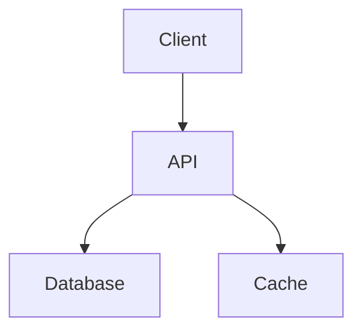

# GHL Hire - Documentation

This folder contains all project documentation organized by category. All documents follow a consistent naming convention with dates for easy tracking.

---

## Folder Structure

```
documents/
├── README.md                 # This file - documentation index
├── sessions/                 # Development session summaries
├── setup/                   # Setup guides and configuration docs
├── architecture/            # Architecture decisions and system design
├── guides/                  # How-to guides and tutorials
└── archive/                 # Archived/deprecated documentation
```

---

## Folder Descriptions

### `/sessions/`
**Purpose**: Track daily development work, decisions, and progress.

**Naming Convention**: `YYYY-MM-DD_session-topic.md`

**Contents**:
- Daily work summaries
- Technical decisions made
- Issues encountered and resolved
- Files created/modified
- Time estimates and actuals
- Handoff notes for team members

**Example**:
- `2025-11-14_database-setup-session.md`

### `/setup/`
**Purpose**: Installation, configuration, and setup instructions.

**Naming Convention**: `YYYY-MM-DD_setup-topic.md`

**Contents**:
- Environment setup guides
- Database configuration
- Third-party service integration
- Deployment procedures
- Troubleshooting guides

**Example**:
- `2025-11-14_setup-complete.md`

### `/architecture/`
**Purpose**: System design, architecture decisions, and technical specifications.

**Naming Convention**: `YYYY-MM-DD_architecture-topic.md` or `topic_architecture.md`

**Contents**:
- System architecture diagrams
- Database schema designs
- API designs
- Technology choices and rationale
- Architecture Decision Records (ADRs)
- Scalability plans

**Examples** (to be created):
- `database_schema_architecture.md`
- `2025-11-XX_authentication-architecture.md`
- `api_design_patterns.md`

### `/guides/`
**Purpose**: Step-by-step tutorials and how-to guides for common tasks.

**Naming Convention**: `topic_guide.md` or `how-to-topic.md`

**Contents**:
- Developer onboarding guides
- Feature implementation tutorials
- Testing guides
- Deployment guides
- Contribution guidelines

**Examples** (to be created):
- `developer_onboarding_guide.md`
- `how-to-add-new-migrations.md`
- `testing_guide.md`
- `deployment_guide.md`

### `/archive/`
**Purpose**: Store outdated, superseded, or deprecated documentation.

**Naming Convention**: `YYYY-MM-DD_original-name.md`

**Contents**:
- Deprecated documentation
- Superseded guides
- Old implementation notes
- Historical reference material

**Archiving Rules**:
- Move documents here when they become outdated
- Always prefix with date archived
- Keep original filename for reference
- Update STATUS to "Archived" in document metadata
- Link to replacement documentation if applicable

**Examples**:
- `2025-11-14_old-setup-guide.md` - Replaced by new setup guide
- `2025-11-14_legacy-architecture.md` - Superseded by new architecture

---

## Document Standards

### Naming Conventions

1. **Date-Prefixed Documents** (sessions, setup):
   - Format: `YYYY-MM-DD_topic-name.md`
   - Use lowercase with hyphens
   - Example: `2025-11-14_database-setup-session.md`

2. **Topic Documents** (architecture, guides):
   - Format: `topic_name.md` or `topic-name.md`
   - Use lowercase with underscores or hyphens
   - Example: `authentication_architecture.md`

### Required Sections

All documentation should include:

1. **Title and Metadata**
   ```markdown
   # Document Title

   **Date**: YYYY-MM-DD
   **Author**: Name or Role
   **Status**: Draft | In Review | Approved | Deprecated
   **Last Updated**: YYYY-MM-DD
   ```

2. **Overview/Summary**
   - Brief description of the document's purpose
   - Who should read it
   - Prerequisites (if any)

3. **Main Content**
   - Clear sections with headings
   - Code examples with syntax highlighting
   - Screenshots/diagrams where helpful

4. **References**
   - Links to related documents
   - External resources
   - API documentation

### Markdown Style Guide

- Use `#` for headers (not underline style)
- Use backticks for inline code: `code`
- Use triple backticks with language for code blocks:
  ````markdown
  ```typescript
  const example = 'code';
  ```
  ````
- Use `---` for horizontal rules
- Use `-` or `*` for unordered lists (be consistent)
- Use `1.` for ordered lists
- Use `**bold**` for emphasis
- Use `*italic*` for slight emphasis
- Use `> ` for blockquotes
- Use `[text](url)` for links
- Use `` for images

---

## Current Documentation

### Sessions (1 document)
- ✅ `2025-11-14_database-setup-session.md` - Database setup and Supabase integration

### Setup (1 document)
- ✅ `2025-11-14_setup-complete.md` - Complete backend setup guide

### Architecture (1 document)
- ✅ `2025-11-14_security-model.md` - Row Level Security and authentication

### Guides (0 documents)
- 🔄 To be created as needed

### Archive (5 documents)
- 📦 `2025-11-14_feature-enhancements.md` - Archived
- 📦 `2025-11-14_implementation-summary.md` - Archived
- 📦 `2025-11-14_mobile-optimization.md` - Archived
- 📦 `2025-11-14_performance.md` - Archived
- 📦 `2025-11-14_setup-guide.md` - Superseded by new setup guide

---

## Recommended Next Documents

### High Priority

1. **Authentication Architecture** (`architecture/`)
   - User authentication flow
   - Session management
   - Role-based access control
   - Security considerations

2. **Developer Onboarding Guide** (`guides/`)
   - Getting started checklist
   - Local development setup
   - Running tests
   - Making first contribution

3. **API Design Patterns** (`architecture/`)
   - REST API conventions
   - Error handling
   - Response formats
   - Versioning strategy

### Medium Priority

4. **Testing Guide** (`guides/`)
   - Unit testing with Jest
   - Integration testing
   - E2E testing with Playwright
   - Test data management

5. **Deployment Guide** (`guides/`)
   - Vercel deployment
   - Environment variables
   - Database migrations
   - Rollback procedures

6. **Database Migration Guide** (`guides/`)
   - Creating new migrations
   - Testing migrations
   - Rolling back changes
   - Best practices

---

## Contributing to Documentation

### When to Create New Documentation

Create a new document when:
1. Starting a new major feature or system
2. Making significant architectural decisions
3. Completing a development session
4. Onboarding new team members
5. Documenting complex procedures

### Documentation Review Process

1. **Create Draft**: Write document with `Status: Draft`
2. **Self-Review**: Check for clarity, completeness, accuracy
3. **Peer Review**: Have another developer review (if applicable)
4. **Approve**: Change status to `Approved`
5. **Update**: Keep documents current as system evolves

### Keeping Documentation Current

- Review documentation quarterly
- Update when making related code changes
- Mark outdated docs with `Status: Deprecated`
- Create new versions when major changes occur
- Link old versions for reference

---

## Documentation Tools

### Recommended Tools

1. **Markdown Editors**:
   - VS Code with Markdown extensions
   - Typora (WYSIWYG Markdown)
   - Obsidian (for linked knowledge base)

2. **Diagram Tools**:
   - Mermaid (text-based diagrams in Markdown)
   - Excalidraw (hand-drawn style)
   - Draw.io / diagrams.net
   - Figma (for UI/UX diagrams)

3. **Screenshot Tools**:
   - macOS: Cmd+Shift+4
   - Windows: Snipping Tool
   - CleanShot X (advanced)

### Mermaid Diagrams

Use Mermaid for inline diagrams in Markdown:

````markdown

````

---

## Search and Navigation

### Finding Documents

1. **By Date**: Look in sessions folder with date prefix
2. **By Topic**: Check folder based on document type
3. **By Search**: Use grep or IDE search
   ```bash
   grep -r "search term" documents/
   ```

### Cross-Referencing

Link between documents using relative paths:
```markdown
See also: [Database Setup](../setup/2025-11-14_setup-complete.md)
```

---

## Backup and Version Control

### Git Integration

- All documentation is version controlled with Git
- Commit documentation with related code changes
- Use descriptive commit messages for docs
- Tag major documentation milestones

### Document History

To see document history:
```bash
git log --follow documents/path/to/file.md
```

To see who last modified a section:
```bash
git blame documents/path/to/file.md
```

---

## Quick Reference

### Common Tasks

**Create Session Document**:
```bash
touch documents/sessions/$(date +%Y-%m-%d)_session-name.md
```

**Create Setup Guide**:
```bash
touch documents/setup/$(date +%Y-%m-%d)_setup-name.md
```

**Create Architecture Doc**:
```bash
touch documents/architecture/system-name_architecture.md
```

**Create Guide**:
```bash
touch documents/guides/how-to-task-name.md
```

---

## Contact and Feedback

For questions about documentation:
- Check existing docs in this folder
- Review project CLAUDE.md for guidelines
- Ask in team chat or create GitHub issue

For documentation improvements:
- Submit PR with suggested changes
- Open issue for missing documentation
- Update this README when adding new patterns

---

**Last Updated**: 2025-11-14
**Maintained By**: Development Team
