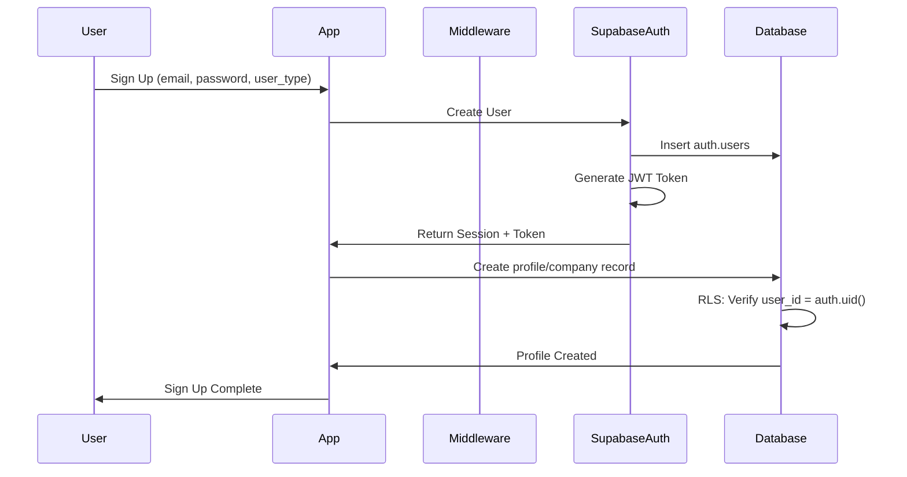
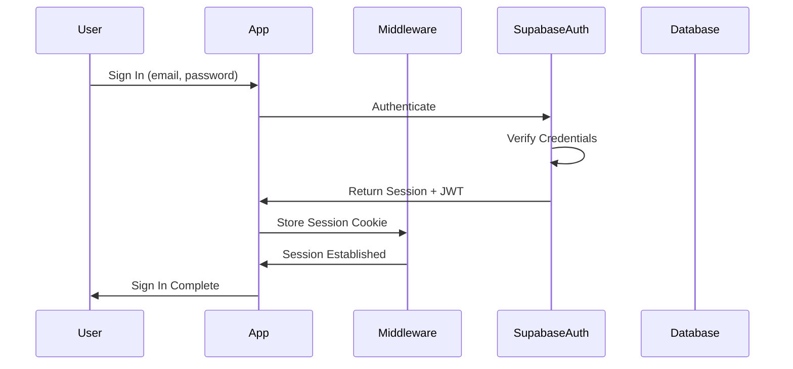

# GHL Hire - Security Model & Row Level Security (RLS) Documentation

**Date**: 2025-11-14
**Author**: Development Team
**Status**: Approved
**Last Updated**: 2025-11-14

---

## Overview

This document describes the comprehensive security model for GHL Hire, focusing on Row Level Security (RLS) policies implemented in Supabase PostgreSQL. The security model ensures data isolation, proper access control, and protection of sensitive user information.

---

## Table of Contents

1. [Security Architecture](#security-architecture)
2. [Authentication Flow](#authentication-flow)
3. [Row Level Security Policies](#row-level-security-policies)
4. [User Roles](#user-roles)
5. [Data Access Patterns](#data-access-patterns)
6. [Security Best Practices](#security-best-practices)
7. [Testing Security](#testing-security)
8. [Common Security Scenarios](#common-security-scenarios)

---

## Security Architecture

### Overview

GHL Hire implements a multi-layered security approach:

```
┌─────────────────────────────────────────┐
│          Client Application             │
│     (Browser / Mobile App)              │
└──────────────┬──────────────────────────┘
               │
               │ HTTPS
               │
┌──────────────▼──────────────────────────┐
│       Next.js Middleware                │
│  - Rate Limiting                        │
│  - Session Validation                   │
│  - CSRF Protection                      │
│  - Security Headers                     │
└──────────────┬──────────────────────────┘
               │
               │ Authenticated Requests
               │
┌──────────────▼──────────────────────────┐
│         Supabase Auth                   │
│  - JWT Token Validation                 │
│  - User Authentication                  │
│  - Session Management                   │
└──────────────┬──────────────────────────┘
               │
               │ auth.uid()
               │
┌──────────────▼──────────────────────────┐
│     Row Level Security (RLS)            │
│  - Policy Evaluation                    │
│  - User-specific Access                 │
│  - Role-based Permissions               │
└──────────────┬──────────────────────────┘
               │
               │ Filtered Data
               │
┌──────────────▼──────────────────────────┐
│      PostgreSQL Database                │
│  - Encrypted at Rest                    │
│  - Encrypted in Transit                 │
└─────────────────────────────────────────┘
```

### Security Layers

1. **Transport Security**: HTTPS/TLS encryption
2. **Middleware Security**: Rate limiting, CSRF, security headers
3. **Authentication**: Supabase Auth with JWT tokens
4. **Authorization**: Row Level Security policies
5. **Data Security**: Encryption at rest and in transit

---

## Authentication Flow

### Sign-Up Process



### Sign-In Process



### Session Management

- **Token Storage**: HTTP-only cookies (secure, SameSite=Lax)
- **Token Refresh**: Automatic refresh before expiration
- **Token Expiration**: 1 hour (configurable)
- **Refresh Token**: 30 days (configurable)

---

## Row Level Security Policies

### Policy Structure

Each RLS policy has:
- **Table**: Which table it applies to
- **Operation**: SELECT, INSERT, UPDATE, DELETE
- **USING clause**: Determines which rows are visible
- **WITH CHECK clause**: Validates new/updated rows

### Core Principles

1. **Default Deny**: All tables have RLS enabled with no default access
2. **Explicit Allow**: Only explicitly granted operations are permitted
3. **User Context**: All policies use `auth.uid()` for user identification
4. **Minimal Privilege**: Users get minimum necessary permissions

---

## User Roles

### Role Hierarchy

```
┌────────────────────────────────────┐
│            Admin                   │
│  - Full platform access            │
│  - Moderation capabilities         │
│  - Analytics access                │
└────────────┬───────────────────────┘
             │
        ┌────┴────┐
        │         │
┌───────▼──┐  ┌───▼──────────┐
│ Employer │  │  Job Seeker  │
│          │  │              │
│ - Post   │  │ - Apply      │
│   jobs   │  │   to jobs    │
│ - View   │  │ - Save       │
│   apps   │  │   jobs       │
│ - Manage │  │ - Set        │
│   subs   │  │   alerts     │
└──────────┘  └──────────────┘
```

### Role Determination

- **Job Seeker**: Has record in `profiles` table
- **Employer**: Has record in `companies` table
- **Admin/Moderator**: Has record in `admin_roles` table
- **User Type**: Stored in profile metadata during signup

---

## Row Level Security Policies

### 1. Profiles Table (Job Seekers)

#### Policy: Public Read Access

**Purpose**: Allow all users to view public profile information.

```sql
CREATE POLICY "Profiles are publicly readable"
ON profiles FOR SELECT
USING (true);
```

**Access**: Everyone (including anonymous)
**Reason**: Job profiles need to be viewable by employers

#### Policy: Users Can Update Their Own Profile

**Purpose**: Users can only modify their own profile data.

```sql
CREATE POLICY "Users can update their own profile"
ON profiles FOR UPDATE
USING (user_id = auth.uid());
```

**Access**: Owner only
**Verification**: `user_id` must match current authenticated user

#### Policy: Users Can Delete Their Own Profile

**Purpose**: Users can delete their account.

```sql
CREATE POLICY "Users can delete their own profile"
ON profiles FOR DELETE
USING (user_id = auth.uid());
```

**Access**: Owner only
**Note**: Cascading deletes handle related data

---

### 2. Companies Table (Employers)

#### Policy: Public Read Access

**Purpose**: Allow viewing of company profiles.

```sql
CREATE POLICY "Companies are publicly readable"
ON companies FOR SELECT
USING (true);
```

**Access**: Everyone
**Reason**: Company profiles visible to job seekers

#### Policy: Company Can Update Their Profile

```sql
CREATE POLICY "Companies can update their own profile"
ON companies FOR UPDATE
USING (user_id = auth.uid());
```

**Access**: Company owner only

---

### 3. Jobs Table

#### Policy: Public Can View Active Jobs

**Purpose**: Public job board access.

```sql
CREATE POLICY "Active jobs are publicly visible"
ON jobs FOR SELECT
USING (status = 'active' OR company_id IN (
    SELECT id FROM companies WHERE user_id = auth.uid()
));
```

**Access**:
- Everyone: Can see active jobs
- Company owners: Can see all their jobs (including drafts)

#### Policy: Companies Can Create Jobs

```sql
CREATE POLICY "Companies can create jobs"
ON jobs FOR INSERT
WITH CHECK (company_id IN (
    SELECT id FROM companies WHERE user_id = auth.uid()
));
```

**Access**: Company owners only
**Validation**: Must own the company

#### Policy: Companies Can Update Their Jobs

```sql
CREATE POLICY "Companies can update their own jobs"
ON jobs FOR UPDATE
USING (company_id IN (
    SELECT id FROM companies WHERE user_id = auth.uid()
));
```

**Access**: Job owner only

#### Policy: Companies Can Delete Their Jobs

```sql
CREATE POLICY "Companies can delete their own jobs"
ON jobs FOR DELETE
USING (company_id IN (
    SELECT id FROM companies WHERE user_id = auth.uid()
));
```

**Access**: Job owner only

---

### 4. Applications Table

#### Policy: Job Seekers Can View Their Applications

```sql
CREATE POLICY "Users can view their own applications"
ON applications FOR SELECT
USING (profile_id IN (
    SELECT id FROM profiles WHERE user_id = auth.uid()
));
```

**Access**: Application owner

#### Policy: Employers Can View Applications to Their Jobs

```sql
CREATE POLICY "Companies can view applications to their jobs"
ON applications FOR SELECT
USING (job_id IN (
    SELECT j.id FROM jobs j
    JOIN companies c ON j.company_id = c.id
    WHERE c.user_id = auth.uid()
));
```

**Access**: Company that posted the job

#### Policy: Job Seekers Can Create Applications

```sql
CREATE POLICY "Users can create applications"
ON applications FOR INSERT
WITH CHECK (profile_id IN (
    SELECT id FROM profiles WHERE user_id = auth.uid()
));
```

**Access**: Authenticated job seekers
**Validation**: Must own the profile

#### Policy: Job Seekers Can Update Their Applications

```sql
CREATE POLICY "Users can update their own applications"
ON applications FOR UPDATE
USING (profile_id IN (
    SELECT id FROM profiles WHERE user_id = auth.uid()
));
```

**Access**: Application owner (e.g., to withdraw)

#### Policy: Employers Can Update Application Status

```sql
CREATE POLICY "Companies can update applications to their jobs"
ON applications FOR UPDATE
USING (job_id IN (
    SELECT j.id FROM jobs j
    JOIN companies c ON j.company_id = c.id
    WHERE c.user_id = auth.uid()
));
```

**Access**: Company owner (e.g., to change status)

---

### 5. Saved Jobs Table

#### Policy: Users Can View Their Saved Jobs

```sql
CREATE POLICY "Users can view their saved jobs"
ON saved_jobs FOR SELECT
USING (profile_id IN (
    SELECT id FROM profiles WHERE user_id = auth.uid()
));
```

**Access**: Owner only

#### Policy: Users Can Save Jobs

```sql
CREATE POLICY "Users can save jobs"
ON saved_jobs FOR INSERT
WITH CHECK (profile_id IN (
    SELECT id FROM profiles WHERE user_id = auth.uid()
));
```

**Access**: Authenticated users

#### Policy: Users Can Remove Saved Jobs

```sql
CREATE POLICY "Users can delete their saved jobs"
ON saved_jobs FOR DELETE
USING (profile_id IN (
    SELECT id FROM profiles WHERE user_id = auth.uid()
));
```

**Access**: Owner only

---

### 6. Job Alerts Table

Similar pattern to saved_jobs - users can only access their own alerts.

---

### 7. Subscriptions Table

#### Policy: Companies Can View Their Subscription

```sql
CREATE POLICY "Companies can view their own subscription"
ON subscriptions FOR SELECT
USING (company_id IN (
    SELECT id FROM companies WHERE user_id = auth.uid()
));
```

**Access**: Company owner only

#### Policy: System Can Manage Subscriptions

```sql
CREATE POLICY "System can manage subscriptions"
ON subscriptions FOR ALL
USING (true)
WITH CHECK (true);
```

**Access**: Service role only (for webhook processing)

---

### 8. Admin Tables (Moderation, Support)

#### Policy: Admin-Only Access

```sql
CREATE POLICY "Admins can view all reports"
ON content_reports FOR SELECT
USING (
    EXISTS (
        SELECT 1 FROM admin_roles ar
        JOIN profiles p ON ar.profile_id = p.id
        WHERE p.user_id = auth.uid()
    )
);
```

**Access**: Admin/Moderator role only
**Verification**: Checks `admin_roles` table

---

## Data Access Patterns

### Job Seeker Access

| Table | SELECT | INSERT | UPDATE | DELETE | Notes |
|-------|--------|--------|--------|--------|-------|
| profiles | ✅ All | ❌ | ✅ Own | ✅ Own | Can view all, modify own |
| companies | ✅ All | ❌ | ❌ | ❌ | Read-only |
| jobs | ✅ Active | ❌ | ❌ | ❌ | Only active jobs |
| applications | ✅ Own | ✅ Own | ✅ Own | ❌ | Can apply and withdraw |
| saved_jobs | ✅ Own | ✅ Own | ❌ | ✅ Own | Bookmark functionality |
| job_alerts | ✅ Own | ✅ Own | ✅ Own | ✅ Own | Full CRUD on own alerts |
| notifications | ✅ Own | ❌ | ✅ Own | ✅ Own | Receive and manage |

### Employer Access

| Table | SELECT | INSERT | UPDATE | DELETE | Notes |
|-------|--------|--------|--------|--------|-------|
| profiles | ✅ All | ❌ | ❌ | ❌ | Can view applicants |
| companies | ✅ All | ❌ | ✅ Own | ✅ Own | Manage own company |
| jobs | ✅ Own (all)<br>✅ Others (active) | ✅ Own | ✅ Own | ✅ Own | Full job management |
| applications | ✅ Own Jobs | ❌ | ✅ Own Jobs | ❌ | View and update status |
| subscriptions | ✅ Own | ❌ | ❌ | ❌ | View subscription info |
| analytics | ✅ Own Jobs | ❌ | ❌ | ❌ | View job performance |

### Admin Access

| Resource | Access Level | Notes |
|----------|-------------|-------|
| All Tables | Full Access | Through service role |
| Moderation | Full CRUD | content_reports, moderation_actions |
| Support | Full CRUD | support_tickets, ticket_messages |
| Analytics | Read-only | Platform-wide statistics |
| User Management | Limited | Can't access passwords |

---

## Security Best Practices

### For Developers

#### 1. Always Use the Correct Client

```typescript
// ✅ Good: In Client Components
import { createClient } from '@/lib/supabase/client'

// ✅ Good: In Server Components
import { createClient } from '@/lib/supabase/server'

// ❌ Bad: Using wrong client
import { createClient } from '@supabase/supabase-js'
```

#### 2. Never Bypass RLS

```typescript
// ❌ Bad: Using service role in client code
const supabase = createClient(url, serviceKey)

// ✅ Good: Use anon key (RLS enforced)
const supabase = createClient(url, anonKey)
```

#### 3. Validate User Ownership

```typescript
// ✅ Good: Let RLS handle it
const { data } = await supabase
  .from('profiles')
  .update({ bio: 'New bio' })
  .eq('id', profileId)

// RLS automatically ensures user_id = auth.uid()
```

#### 4. Use Specific Columns

```typescript
// ❌ Bad: Select everything
const { data } = await supabase
  .from('profiles')
  .select('*')

// ✅ Good: Select only needed columns
const { data } = await supabase
  .from('profiles')
  .select('id, full_name, email, bio')
```

#### 5. Handle Sensitive Data

```typescript
// ✅ Good: Don't expose service key
// Use environment variables
const key = process.env.SUPABASE_SERVICE_ROLE_KEY

// ❌ Bad: Hardcoded keys
const key = 'eyJhbG...'
```

### For Testing

#### Test with Different User Contexts

```typescript
// Test as job seeker
const jobSeekerClient = createClientAs(jobSeekerId)

// Test as employer
const employerClient = createClientAs(employerId)

// Test as admin
const adminClient = createClientAs(adminId)

// Test as anonymous
const anonClient = createClient() // No auth
```

#### Verify RLS Policies

```typescript
// Should succeed - own profile
await supabase
  .from('profiles')
  .update({ bio: 'test' })
  .eq('user_id', currentUserId)

// Should fail - other user's profile
await supabase
  .from('profiles')
  .update({ bio: 'test' })
  .eq('user_id', otherUserId)
// Expect: 0 rows affected (RLS blocks)
```

---

## Testing Security

### Manual Testing Checklist

- [ ] Anonymous users can view active jobs
- [ ] Anonymous users cannot view draft jobs
- [ ] Users can only update their own profiles
- [ ] Users cannot update other users' profiles
- [ ] Companies can only view applications to their jobs
- [ ] Job seekers can only view their own applications
- [ ] Users can only delete their own saved jobs
- [ ] Admins can access moderation tables
- [ ] Non-admins cannot access moderation tables

### Automated Test Example

```typescript
// Test: Users can only update own profile
describe('Profile RLS', () => {
  it('allows users to update their own profile', async () => {
    const { error } = await supabase
      .from('profiles')
      .update({ bio: 'Updated' })
      .eq('user_id', currentUserId)

    expect(error).toBeNull()
  })

  it('prevents users from updating others profiles', async () => {
    const { data, error } = await supabase
      .from('profiles')
      .update({ bio: 'Hacked!' })
      .eq('user_id', otherUserId)

    expect(data).toHaveLength(0) // No rows affected
  })
})
```

---

## Common Security Scenarios

### Scenario 1: Job Seeker Applies to Job

**Flow**:
1. Job seeker views active job (RLS: ✅ public read)
2. Clicks "Apply" button
3. Submits application form
4. System creates application record

**RLS Checks**:
- ✅ Job is active (SELECT policy)
- ✅ Profile belongs to current user (INSERT policy)
- ✅ Application profile_id matches auth.uid()

### Scenario 2: Employer Views Applications

**Flow**:
1. Employer navigates to applications page
2. System queries applications table
3. RLS filters to only their jobs' applications

**RLS Checks**:
- ✅ Job belongs to employer's company (SELECT policy)
- ✅ Company user_id matches auth.uid()
- ❌ Cannot see applications to other companies' jobs

### Scenario 3: Admin Moderates Content

**Flow**:
1. Admin views content reports
2. System checks admin_roles table
3. Admin takes moderation action

**RLS Checks**:
- ✅ User has admin role (SELECT policy on content_reports)
- ✅ Admin role is active
- ✅ Can create moderation_actions

### Scenario 4: Anonymous User Browses Jobs

**Flow**:
1. Anonymous user visits job board
2. System queries jobs table
3. RLS returns only active jobs

**RLS Checks**:
- ✅ Job status = 'active' (SELECT policy)
- ❌ Cannot see draft jobs
- ❌ Cannot see company-specific analytics

---

## Security Incident Response

### If RLS Bypass Suspected

1. **Immediate Actions**:
   - Review Supabase logs for suspicious queries
   - Check for service role key exposure
   - Verify all RLS policies are enabled

2. **Investigation**:
   - Identify affected tables
   - Determine scope of unauthorized access
   - Review recent code changes

3. **Remediation**:
   - Fix vulnerable policies
   - Rotate API keys if exposed
   - Deploy fixes immediately
   - Notify affected users if necessary

4. **Prevention**:
   - Add automated RLS tests
   - Conduct security audit
   - Update documentation

---

## Security Audit Checklist

### Regular Reviews (Monthly)

- [ ] All tables have RLS enabled
- [ ] No service role key in client code
- [ ] API keys rotated (if needed)
- [ ] Security headers configured
- [ ] Rate limiting working
- [ ] No SQL injection vulnerabilities
- [ ] File upload validation working
- [ ] Session management secure
- [ ] CORS properly configured
- [ ] Logs reviewed for anomalies

### Before Production Deploy

- [ ] All RLS policies tested
- [ ] Security headers verified
- [ ] HTTPS enforced
- [ ] Environment variables secured
- [ ] Database backups configured
- [ ] Monitoring alerts set up
- [ ] Incident response plan documented

---

## References

### Internal Documentation
- [Setup Complete Guide](../setup/2025-11-14_setup-complete.md)
- [Database Schema](../../supabase/migrations/)
- [PRODUCTION_STORIES.md](../../PRODUCTION_STORIES.md)

### External Resources
- [Supabase RLS Documentation](https://supabase.com/docs/guides/auth/row-level-security)
- [PostgreSQL RLS Policies](https://www.postgresql.org/docs/current/ddl-rowsecurity.html)
- [Supabase Security Best Practices](https://supabase.com/docs/guides/auth/security)
- [OWASP Top 10](https://owasp.org/www-project-top-ten/)

---

## Change Log

| Date | Change | Author |
|------|--------|--------|
| 2025-11-14 | Initial security model documentation | Development Team |

---

**Last Updated**: 2025-11-14
**Next Review**: 2025-12-14
**Status**: Approved
